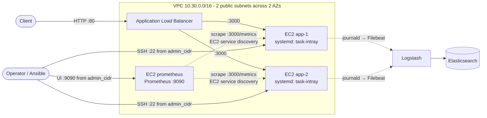

# task-intray

A small Node.js (Express) service deployed end to end on AWS. Terraform provisions the network, an Application Load Balancer and EC2 instances; Ansible installs and runs the app as a systemd service; a Prometheus server collects metrics and alerts, and ELK configs cover logs; GitHub Actions lints, tests and packages everything.

## Architecture



- **Load balancer** listens on port 80 and health-checks `GET /health` on each instance.
- **Instances** run Amazon Linux 2023 with Node.js 22; the app listens on port 3000, reachable only from the load balancer and the Prometheus host (and optionally from `monitoring_cidrs`).
- **Prometheus** runs on its own instance, finds the app instances through EC2 service discovery, and evaluates the alert rules. It can be turned off with `enable_monitoring = false`.
- **Terraform state** is stored in S3 with native lock files (`use_lockfile`).

## Repository layout

| Path | Contents |
|---|---|
| `app/` | Express app (`src/`), Jest tests (`test/`) |
| `terraform/` | Root module plus `network`, `alb`, `compute` and `monitoring` modules |
| `ansible/` | Playbooks (`playbook.yml` for the app, `monitoring.yml` for Prometheus), systemd unit templates, collection requirements |
| `scripts/build_inventory.sh` | Builds the Ansible inventory from Terraform outputs |
| `monitoring/` | Prometheus config and alert rules (installed by `ansible/monitoring.yml`) |
| `logging/` | Filebeat and Logstash configs |
| `.github/workflows/ci.yml` | CI pipeline |

## Application endpoints

| Endpoint | Purpose |
|---|---|
| `GET /` | Service name, status and hostname |
| `GET /health` | Liveness check (used by the load balancer) |
| `GET /ready` | Readiness check |
| `GET /metrics` | Prometheus metrics: default process metrics plus `http_request_duration_seconds` |
| `GET /error` | Returns 500, for testing alerts |

## Run the app locally

Requires Node.js 22 or later.

```bash
cd app
npm ci
npm test        # lint with: npm run lint
npm start       # listens on http://localhost:3000 (override with PORT)
```

## Deploy to AWS

### Prerequisites

- An AWS account and credentials for the AWS CLI / Terraform (for example `aws configure` or `AWS_PROFILE`)
- Terraform 1.10 or later
- Ansible (with `ansible-galaxy`), `jq` and `bash`. On Windows, run the Ansible steps from WSL.
- An SSH key pair; the public key goes into Terraform, the private key is used by Ansible

### 1. Create the state bucket (once)

Terraform stores its state in the S3 bucket named in [`terraform/backend.tf`](terraform/backend.tf), and that bucket must exist before `terraform init`. Either create a bucket with that name, or change `bucket` and `region` in `backend.tf` to one you own. Enable versioning so older state can be recovered:

```bash
aws s3api create-bucket --bucket <state-bucket> --region us-east-1
aws s3api put-bucket-versioning --bucket <state-bucket> --versioning-configuration Status=Enabled
```

### 2. Provision the infrastructure

```bash
cd terraform
cp terraform.tfvars.example terraform.tfvars
```

Edit `terraform.tfvars`:

| Variable | Description | Default |
|---|---|---|
| `public_key` | SSH public key content (required) | — |
| `admin_cidr` | Your IP as a /32, allowed to SSH for Ansible | `127.0.0.1/32` (no access) |
| `aws_region` | AWS region | `us-east-1` |
| `instance_count` | Number of EC2 instances | `2` |
| `instance_type` | EC2 instance type | `t3.micro` |
| `enable_monitoring` | Create the Prometheus instance | `true` |
| `prometheus_instance_type` | Instance type for Prometheus | `t3.small` |
| `monitoring_cidrs` | Extra CIDRs (for example an external Prometheus) allowed to scrape port 3000 | `[]` |
| `project_name` | Prefix for resource names | `task-intray` |

`terraform.tfvars` is git-ignored. Then:

```bash
terraform init
terraform plan -out=tfplan
terraform apply tfplan
```

Outputs: `application_url` (the load balancer URL), `instance_public_ips`, `prometheus_url` and `monitoring_public_ip`.

### 3. Build the Ansible inventory

```bash
./scripts/build_inventory.sh
```

This writes `ansible/inventory.ini` (git-ignored) with an `[app]` group and, when monitoring is enabled, a `[monitoring]` group.

### 4. Package the app

From the repository root:

```bash
tar -czf app.tar.gz -C app package.json package-lock.json src
```

CI also builds this archive on every run; you can download it from the workflow run's artifacts instead.

### 5. Deploy with Ansible

```bash
cd ansible
ansible-galaxy collection install -r requirements.yml
ansible-playbook playbook.yml --private-key ~/.ssh/<your-key>
```

The playbook deploys to one host at a time (`serial: 1`) and restarts the service when the code, dependencies or unit file change. It reads `../app.tar.gz` by default; set `APP_ARCHIVE=/path/to/app.tar.gz` to use another archive.

Then install Prometheus on the monitoring host:

```bash
ansible-playbook monitoring.yml --private-key ~/.ssh/<your-key>
```

This downloads a pinned Prometheus release from GitHub (checksum verified), installs `monitoring/prometheus.yml` and `monitoring/alerts.yml` after validating them with `promtool`, and runs Prometheus as a systemd service. Re-run it after editing either file; config changes are applied with a reload, not a restart.

### 6. Check it works

```bash
curl "$(terraform -chdir=terraform output -raw application_url)/health"
```

Instances can take a minute to pass the load balancer's health checks after a deploy.

Open `prometheus_url` (`terraform output -raw prometheus_url`) from your admin IP. Under **Status → Targets**, the `task-intray` job should list every app instance as **UP**.

### Tear down

```bash
cd terraform
terraform destroy
```

The state bucket is not managed by Terraform and is left in place.

## Monitoring and logging

### Prometheus

- **Where it runs:** the `monitoring` Terraform module creates a dedicated EC2 instance (tagged `Role=monitoring`) with an encrypted 20 GiB volume for 15 days of data. Its IAM role allows only `ec2:DescribeInstances` and `ec2:DescribeAvailabilityZones`. The UI on port 9090 and SSH are open to `admin_cidr` only.
- **What it scrapes** ([`monitoring/prometheus.yml`](monitoring/prometheus.yml)): itself, and every running instance tagged `Role=application`, over its private IP on port 3000. New or replaced app instances are picked up automatically. The region comes from the instance metadata.
- **Alerts** ([`monitoring/alerts.yml`](monitoring/alerts.yml)): an app instance unreachable for 2 minutes, 5xx error rate above 5%, process CPU above 80%, and resident memory above 500 MB (the last three sustained for 5 minutes). Firing alerts show under **Alerts** in the Prometheus UI; there is no Alertmanager yet, so nothing sends notifications.
- **Upgrading:** change `prometheus_version` in [`ansible/monitoring.yml`](ansible/monitoring.yml) and the matching image tag in the CI workflow, then re-run the playbook.

### Logging

The configs in `logging/` are **reference configs**: nothing in this repo deploys Filebeat or ELK.

- **Logs**: the app writes JSON lines to stdout, which systemd sends to journald. Filebeat reads the `task-intray.service` unit's journal and ships it to Logstash, which parses the JSON and indexes into `task-intray-YYYY.MM.dd`.

## CI

[`.github/workflows/ci.yml`](.github/workflows/ci.yml) runs on pull requests, pushes to `main`, and manually:

| Job | Checks |
|---|---|
| App | `npm ci`, ESLint, Jest with coverage; uploads `app.tar.gz` and the coverage report as artifacts |
| Terraform | `fmt -check`, `validate`, tflint, Checkov (report-only for now) |
| Ansible | `ansible-lint` on both playbooks |
| Configs | ShellCheck on `scripts/`, `promtool check config` on the Prometheus config and alert rules |

## Known limitations

This is an exercise setup; before using it for anything real:

- Instances have public IPs and SSH is open to `admin_cidr`. Private subnets with SSM Session Manager would remove port 22.
- The load balancer serves plain HTTP; `/metrics` and `/error` are publicly reachable through it.
- The Prometheus UI has no authentication or TLS; it relies on the `admin_cidr` restriction.
- Ansible skips SSH host-key checking.
- Deploys aren't health-checked per host and there is no rollback.
